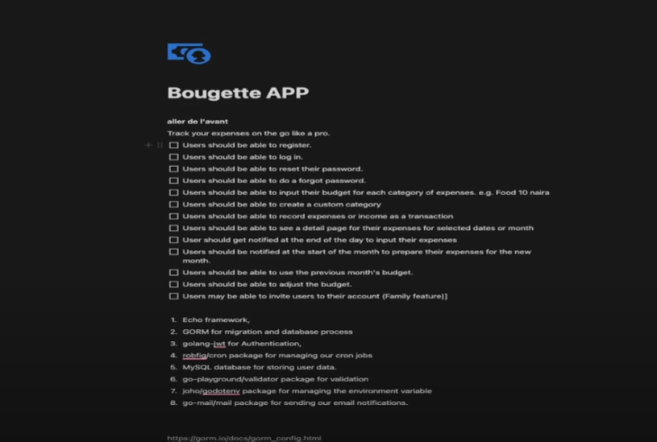

1. Echo framework
2. GORM for migration and DB process
3. Golang-jwt for auth
4. robfig/cron package for managing cron jobs
5. MySQL for DB to store data
6. Validator package for validation.
7. goDotenv for env vars
8. go-mail for sending mail notifications

cmd --> api implementations are here
internal --> DBs, models, things that cannot be reused elsewhere
main.go --> entry point of go application

# Initializing Go project

go mod init github.com/Wanjie-Ryan/Go-Budget

# Getting env variables

go get github.com/joho/godotenv

# Initalizing Echo

go get github.com/labstack/echo/v4

handlers folder --> controllers
middlewares --> anything regarding middlewares
request --> houses any struct that is used to constructu reeequest coming into the application
services --> communicate with DB
common folder houses anything that we want to call globally in our app

# Installing GORM

go get -u gorm.io/gorm
--> install the specific gorm that you require, in this case, mysql
go get -u gorm.io/driver/mysql

# Pointer Receivers

type Counter struct{
N int
}

// the value receiver here works on a copy of the struct
// any change here only affects the local copy
func (c Counter) IncrementValue(){
c.N++
}

// Pointer receiver, works on the original struct
// change here persist after the call returns.
func (c \*Counter) IncrementPointer(){
c.N++
}

**func (h *Handler) ValidateBodyRequest(c echo.Context, payload interface{}) []*common.ValidationError**

the \*Handler ensures that any method that uses the same struct in memory, and modifies any of its values, the changes stick.

# Real World Analogy

Value Receiver --> photocopying sth; you change your copy (photocopy) but the original stays untouched
Pointer receiver --> writing in the original recipe book; your edits stick

# Installing a middleware for logging requests

go get github.com/labstack/echo/v4/middleware

## Project Roadmap

# Database migration

Code that brings your DB schema into sync with your models; creating tables, adding columns, indexes, etc etc

**go run {{path to your migration file}}**

# Validator

go get github.com/go-playground/validator/v10

# POINTERS

pointer holds the **memory address** of another value
its like a signpost that says **go look over there** rather than carrying the value itself.

# Interfaces

they can hold anyhting, its like using the any keyword, they can hold any data type, just declared, and used later.

**Cyclic imports are not allowed in go, like you common can't import handler, then later proceed to import handler in common.**

echo's handler expects your handler to return an error
func getWoo (c echo.context) err{
return {....}
}

# Go Password Hashing

go get golang.org/x/crypto/bcrypt

# SMTP

Simple Mail Transfer Protocol
-- Standard protocol on the internet for sending email from one server to another, and from your app to an email server.

# Role of SMTP

1. client-server submission
   -- when you hit send in your mail app, or from SMTP lib from your code, your mail client connects to an SMTP server to hand off message.

2. Server to server relay
   -- SMTP server may connect to other SMTP servers until it reaches the recipients mail server.

3. Server to client retrieval

# How SMTP works

1. Connection
   -- Client opens a TCP connection on port 25 for server to server
2. Handshake
   -- Client says **EHLO your-domain.com** and the server replies with the list of extensions it supports. (TLS, auth methods, size limits)
3. Authentication
4. Mail Transaction
   -- mail from <you@you.com> --> recipient to <bambam@hj.com> --> Data Stream the headers and body of your email, ending with a single line containing a dot
5. Quit
   -- client sends QUIT and both sides close the connection

# Installing Mailing Services for Go

Go Mail --> go get gopkg.in/gomail.v2

use Mail Trap

# Embed package

-- help one bundle static HTML FILES, CSS, IMAGES, directly into your Go binary at compile time.

// in Go types live under package scope

# Installing JWT in Go

go get -u github.com/golang-jwt/jwt/v5

Putting a pointer to an argument in a function like, also means that the string can be nil
func GetMe (message \*string){

}

FieldName string `json:"-"
the meaning of the hyphen, usually used when creating models or DTOs in GO
The field is **completely** ignored by JSON.

1. when marshaling (encoding) --> the field will **not appear** in the JSON output (response to client).
2. when unmarshalling (decoding) --> this field will **not** be read from JSON input (request body).

## Difference between the two variable declaration

1. var categories []\*models.CategoryModel

above is used as a pointer to a **LIST** of memory addresses.
used when you expect multiple categories

2. var categories \*models.CategoryModel
   used when its a single pointer to one categorymodel struct
   used when you expect one single category

## How to Declare an index in go using GORM

Title string `gorm:"index; type:varchar(200);not null"`

The above model declaration tells GORM to create a DB index on the column.
Indexe make searching/filtering faster, although it DOES NOT enfore uniqueness

onDelete cascade --> if a user is deleted, their budgets are automatically deleted

## Example on Indexing

Title string `gorm:"index;type:varchar(200);not null" json:"title"`
run the query above
db.Where("title = ?", "Monthly rent").Find(&budgets)
**Because title is indexed, the DB will use the index to jump to the rows where title = "Monthly rent"**
**Without the index, the DB would have to scan all 1000 rows, checking each one.**

1. index --> adds a normal index (unnamed, auto-generated by GORM)
2. index:<name> --> Adds a named index (useful when indexing multiple fields together)
3. unique --> Adds a single column unique constrint
4. uniqueIndex:<name> --> Adds a named multi-column unique contraint (like a composite key)

## Example 2 the index with the name

Month uint `gorm:"index:idx_month_year"`
Year uint16 `gorm:"index:idx_month_year"`

The above creates sth like a composite index
CREATE INDEX idx_month_year ON budget(month, year);

helps one filter faster using both fields together, like
**db.Where("month = ? AND year = ?", 7, 2025).Find(&budgets)**

## Example 4 explanation the UniqueIndex:<name>

Slug string `gorm:"uniqueIndex:unique_user_id_slug_year_month"`
UserID uint `gorm:"uniqueIndex:unique_user_id_slug_year_month"`
Month uint `gorm:"uniqueIndex:unique_user_id_slug_year_month"`
Year uint16 `gorm:"uniqueIndex:unique_user_id_slug_year_month"`

the above means

1. user CANNOT have 2 budgets with the same slug in the same year and month.
2. combination of these 4 fields must be unique

SQL Equivalent
CREATE UNIQUE INDEX unique_user_id_slug_year_month
ON budget(user_id, slug, year, month);
